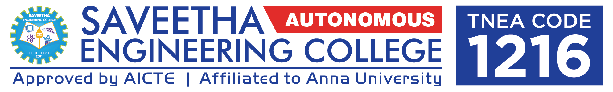

# Ex02 Time Table
## Date:

## AIM
To write a html webpage page to display your slot timetable.

## ALGORITHM
### STEP 1
Create a Django-admin Interface.

### STEP 2
Create a static folder and inert HTML code.

### STEP 3
Create a simple table using ```<table>``` tag in html.

### STEP 4
Add header row using ```<th>``` tag.

### STEP 5
Add your timetable using ```<td>``` tag.

### STEP 6
Execute the program using runserver command.

## PROGRAM
```
html>
    <head>
        <title>Time Table</title>
    </head>
    <body align="center">
        git
        <h2>SLOT TIME TABLE-VARSHA  S(25017486)</h2>
        <table border="3" cellpadding="6" align="center">
            <tr bgcolor="#fb6f92">
                <th>Day/Time</th>
                <th>Monday</th>
                <th>Tuesday</th>
                <th>Wednesday</th>
                <th>Thursday</th>
                <th>Friday</th>
                <th>Saturday</th>
            </tr>
            <tr align="center" bgcolor="#ff8fab">
                <th bgcolor="fb6f92">08:00-10:00</th>
                <td colspan="2">FREE</td>
                <td>OS</td>
                <td>OS</td>
                <td>OS</td>
                <td>FREE</td>
            <tr align="center" bgcolor="#ff8fab">
                <th bgcolor="fb6f92">10:00-12:00</th>
                <td>OS</td>
                <td>FWAD</td>
                <td>FWAD</td>
                <td>FREE</td>
                <td>FWAD</td>
                <td>FREE</td>
            </tr>
            <tr align="center" bgcolor="#ff8fab">
                <th bgcolor="fb6f92">12:00-01:00</th>
                <td colspan="6">LUNCH</td>
            </tr>
            <tr align="center" bgcolor="#ff8fab">
                <th bgcolor="fb6f92" >01:00-03:00</th>
                <td>FREE</td>
                <td>FWAD</td>
                <td>MENTOR MEET</td>
                <td>C</td>
                <td>C</td>
                <td>FREE</td>
            </tr>
            <tr align="center" bgcolor="#ff8fab">
                <th bgcolor="fb6f92">03:00-05:00</th>
                <td colspan="2">FREE</td>
                <td>C</td>
                <td>C</td>
                <td colspan="2">FREE</td>
            </tr>
        </table>
        <br><br>
        <table border="3" cellpadding="15" align="center">
            <tr bgcolor="48CAE4">
                <th>S.No</th>
                <th>Subject Code</th>
                <th>Subject Name</th>
            </tr>
            <tr bgcolor="90E0EF">
                <td align="center" bgcolor="48CAE4">1.</td>
                <td align="center">19AI414</td>
                <td>Fundamentals of Web Application Development (FWAD)</td>
            </tr>
            <tr bgcolor="90E0EF">
                <td align="center" bgcolor="48CAE4">2.</td>
                <td align="center">19AI304</td>
                <td>Fundamentals of C Programming (C)</td>
            </tr>
            <tr bgcolor="90E0EF">
                <td align="center" bgcolor="48CAE4">3.</td>
                <td align="center">19CS405</td>
                <td>Operating System (OS)</td>
            </tr>
             
        </table>
    </body>
</html>
```

## OUTPUT
.png>)

## RESULT
The program for creating slot timetable using basic HTML tags is executed successfully.
